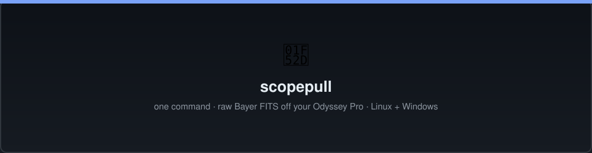
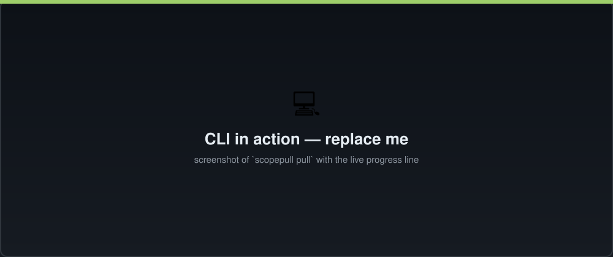
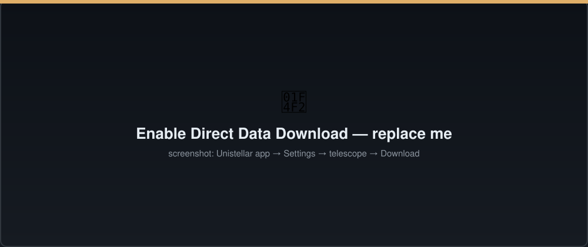
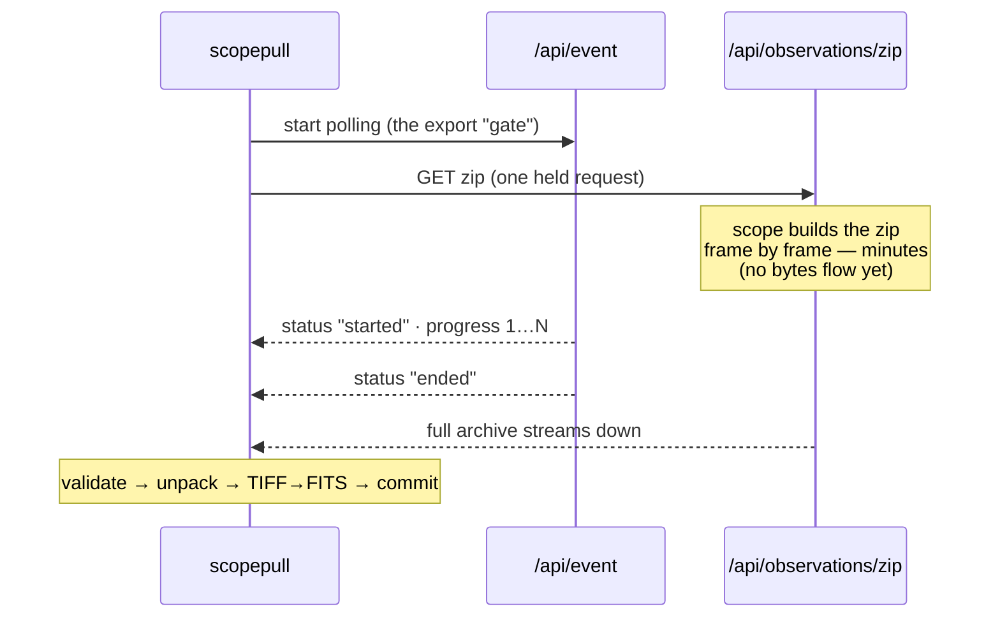
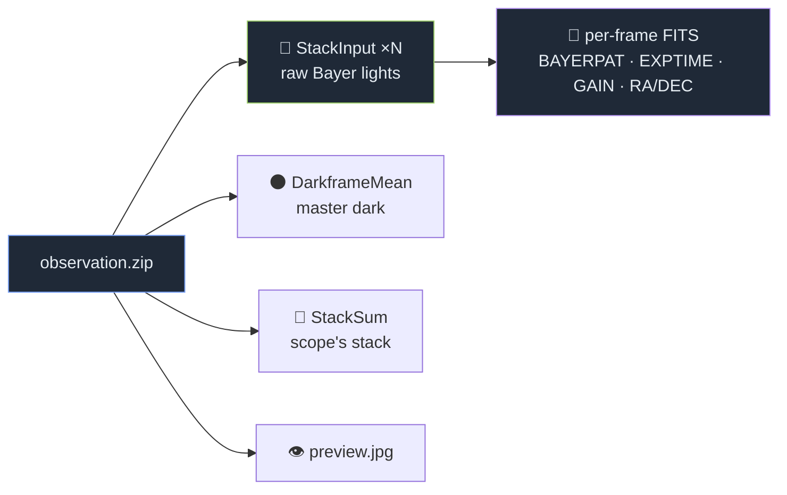
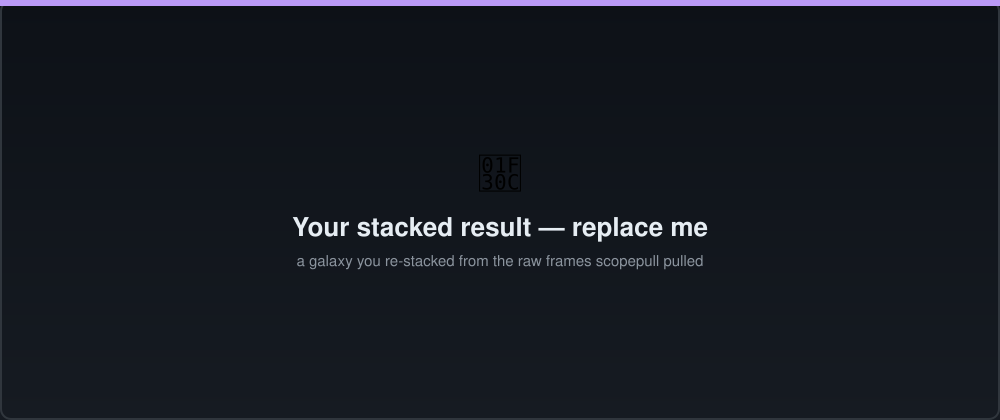

<div align="center">



# 🔭 scopepull

**One command. Raw Bayer FITS off your Unistellar Odyssey Pro — verified, organized, done.**

[](.github/workflows/ci.yml)
[](pyproject.toml)
[](#-install)
[](LICENSE)
[](tests/)

*Connect to the scope's Wi-Fi, run `scopepull`, and every observation you don't already have lands on disk as raw Bayer TIFF **and** science-ready FITS — with the master dark and the scope's own stack alongside it.*

</div>

---

> ### 🙏 Standing on prior art
> The hard part — reverse-engineering the scope's HTTP API — began with
> [**vamshikesireddy/unistellar-data-downloader**](https://github.com/vamshikesireddy/unistellar-data-downloader)
> (MIT), which discovered the crucial trick: **the backend won't stream data unless a client is
> concurrently polling `/api/event`.** scopepull builds on that knowledge (fully documented in
> [docs/API.md](docs/API.md)) with a rewritten async, manifest-aware pipeline. **Just want simple
> "pick observations, get zips"? Use their tool** — it's excellent at exactly that. scopepull is for
> the archival-sync use case: idempotent re-runs, verified atomic ingest, an organized archive, and
> the biggest observations pulled reliably where the browser drops them.

---

## ✨ What it does


- 🟢 **One command** — `scopepull` pulls everything you don't already have. Safe to re-run (idempotent).
- 🧬 **Raw science data** — deep-sky frames arrive as raw **Bayer** mosaics, converted to FITS locally with full headers (`BAYERPAT`, `EXPTIME`, `GAIN`, `RA`/`DEC`, `DATE-OBS`). `BAYERPAT` is **measured from the pixels** — the export is **RGGB as stored** even though the sensor is GBRG (see [docs/API.md](docs/API.md#bayer-pattern)).
- 🎁 **The whole calibration set** — every observation ships its **master dark** and the **scope's own stack**, so you can re-stack the raw frames yourself and diff against what the scope did.
- 🪟🐧 **Linux *and* Windows** — same code, verified pulling multi-GB observations on both.
- 🛟 **Survives the flaky Pi Wi-Fi** — held-connection keepalive, atomic transactional ingest (no half-observations), retry at observation granularity.

<div align="center">

</div>

---

## 🚀 Install

```bash
uv tool install scopepull      # or:  pipx install scopepull
```
<sub>(pre-release: `git clone` + `uv sync`, then `uv run scopepull …`)</sub>

## ⚡ Quickstart

```bash
# 1. Enable Direct Data Download in the Unistellar app (once — the scope remembers)
# 2. Join the scope's Wi-Fi:  Odyssey-xxxx  (older models: UNI-xxxx / eVscope-xxxx)
scopepull doctor        # ✅ connectivity + DDD + free-disk check
scopepull               # ⬇️  pull everything new
scopepull list          # 📋 what's on the scope, and what's already local
scopepull status        # 📦 your local archive summary
```

<div align="center">

</div>

---

## 🧩 How it works (the cracked protocol)

The scope builds each export **frame-by-frame on its own hardware** (~1 frame/sec) and only streams
the finished zip over a **single held HTTP GET** — while a concurrent event-poll keeps the "gate"
open. Getting this exactly right is what makes big pulls reliable:



> 💡 **Two hard-won rules** (see [docs/API.md](docs/API.md)): **never** `cancelDownload` before the
> GET (it suppresses the build), and keep the socket alive with TCP keepalive so a long idle build
> doesn't get its connection reset.

---

## 🏗️ Architecture

```mermaid
flowchart TD
    subgraph net["🌐 network"]
        SC["client.py<br/>httpx + event pump + keepalive"]
    end
    subgraph core["🧠 library"]
        CAT["catalog.py<br/>parse observations"]
        TR["transfer.py<br/>held GET, stream, verify"]
        ING["ingest.py<br/>unpack · TIFF→FITS · atomic"]
        MAN["manifest.py<br/>SQLite: what's local"]
    end
    subgraph plat["🖥️ platform/"]
        LX["linux.py — nmcli"]
        WN["windows.py — netsh"]
    end
    CLI["cli.py — typer + rich"] --> SC --> CAT --> TR --> ING --> MAN
    SC -.SSID / Wi-Fi.-> plat
    style net fill:#0d1117,stroke:#7aa2f7
    style core fill:#0d1117,stroke:#9ece6a
    style plat fill:#0d1117,stroke:#e0af68
```



Everything OS-specific lives in `platform/`; the pull → verify → ingest pipeline is pure, async, and identical on Linux and Windows.

---

## 📂 What lands on disk

Each observation becomes a self-contained folder — raw frames, calibration, the scope's reference stack, and full metadata:

```
~/Astro/odyssey/2026-01-31/m81-bode-s-galaxy__38102043/
├── frames/
│   ├── ..._StackInput.tiff      # 🧬 raw Bayer light frames (RGGB as stored)
│   └── ..._StackInput.fits      # ➕ same data as FITS (BAYERPAT, EXPTIME, RA/DEC…)
├── calibration/
│   ├── ..._DarkframeMean.tiff   # 🌑 master dark
│   └── ..._DarkframeMean.fits
├── reference/
│   ├── ..._StackSum.tiff        # 🔭 the scope's OWN stacked result
│   └── preview.jpg              # 👁️ quick-look
├── observation.json             # 📄 all metadata + pull info
└── SHA256SUMS                   # 🔐 integrity
```



**Why the calibration set matters:** you get the raw lights **+** the dark **+** the scope's own stack — so you can calibrate and re-stack yourself, then compare against the scope's result. *"Did Deep Dark eat my nebula's outer shell?"* — now you can actually check.

<div align="center">

</div>

---

## 🛠️ CLI reference

| Command | What it does |
|---|---|
| `scopepull` | Pull everything **new** (== `pull --new`) |
| `scopepull pull [--new\|--all] [--since DATE] [--target TEXT]` | Pull, filtered |
| `scopepull list [--json]` | List observations + whether each is already local |
| `scopepull doctor` | Connectivity + DDD + free-disk preflight |
| `scopepull status` | Local archive summary |
| `scopepull cancel` | Clear a stuck server-side job |

---

## ⚠️ Things that matter

- **Enable Direct Data Download first** — Unistellar app → Settings → your telescope → Download → Direct Data Download. The scope remembers it.
- **Don't operate the scope while pulling.** Interrupted transfers have been seen to lose observations *on the scope itself* — scopepull snapshots the catalog and is transactional, but be kind to the link.
- **No USB data path.** The USB-A port is power-out only; Wi-Fi is the only way in.
- **The scope's Wi-Fi is ~10 m, 2.4 GHz, and Pi-class.** Big observations take minutes to build server-side before they stream — that's normal; the progress line shows the build.

### 🧯 Reliable pulls on a flaky link (field-tested tips)

<details>
<summary><b>Big pulls drop mid-transfer on Windows</b></summary>

Two common culprits, both fixable:
- **USB Wi-Fi adapter power-saving** — disable it (Device Manager → *USB Root Hub* → Power Management, and set the wireless adapter to Maximum Performance in the power plan).
- **Windows dropping the "no-internet" scope network** — set `fMinimizeConnections = 0` under `HKLM\SOFTWARE\Policies\Microsoft\Windows\WcmSvc\GroupPolicy` (or `gpedit`: Network → Windows Connection Manager → *Minimize simultaneous connections* → allow). ⚠️ Don't restart the WLAN service to apply it — reboot instead.
</details>

<details>
<summary><b>Dual-homing: internet + scope at the same time</b></summary>

Give each radio one job so they can't fight:
- **Adapter A → your normal Wi-Fi/Ethernet** (internet).
- **Adapter B → the scope only.** Remove your home-Wi-Fi profile *from adapter B* so it can't roam off the scope mid-pull.

This is exactly how the biggest observation (710 frames, 2.3 GB) was pulled reliably.
</details>

---

## 🧪 Development

```bash
uv sync --group dev
uv run pytest          # 47 tests, incl. a FastAPI mock of the scope's protocol
uv run ruff check src tests
uv run mypy
```

CI runs the suite on **ubuntu-latest + windows-latest** × Python 3.11/3.12.

---

## 📜 License

MIT — see [LICENSE](LICENSE). Built for [Unistellar](https://www.unistellar.com/) Odyssey / Odyssey Pro (and any `evsoft` scope: eVscope, eQuinox). Not affiliated with Unistellar.

<div align="center">
<sub>🌌 Go stack some galaxies.</sub>
</div>
